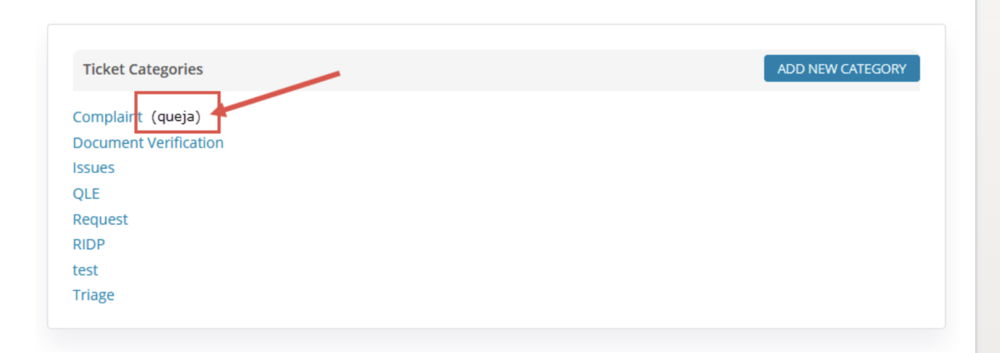
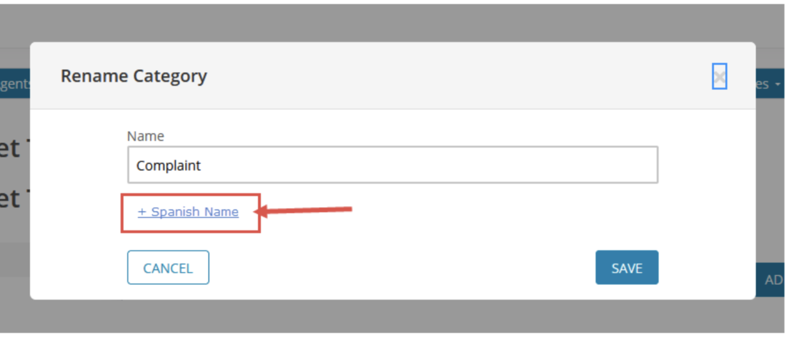
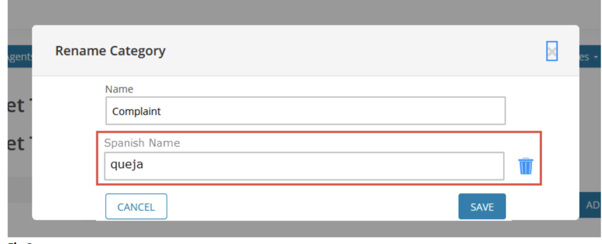
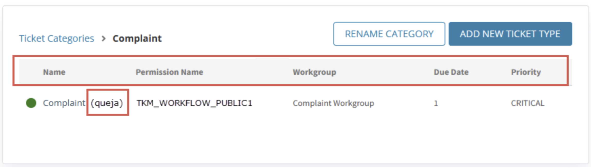
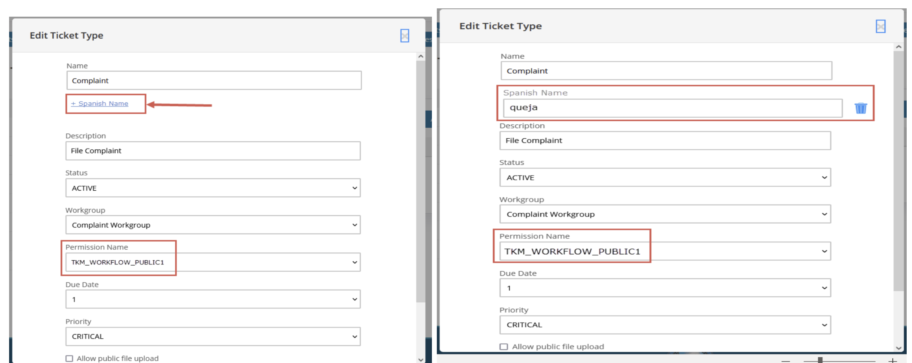

# HIX-174068 Spanish Ticket type support
[Click here to view One-Pager](https://giprod.sharepoint.com/:w:/r/sites/GetInsuredSBMClientCenter/crossclientcollaboration/_layouts/15/Doc.aspx?sourcedoc=%7B07026ECC-A55B-47C6-860D-D42CD706CD38%7D&file=HIX-174068%20-%20Spanish%20Ticket%20type%20support.docx&action=default&mobileredirect=true)

This document briefly describe about adding spanish name for ticket category and sub-types.

# Manage Ticket Category: 

Flow:-

* Login as a admin and click on my tickets. 
* select manage ticket types. 

## Task 1 :- Showing Spanish Text On Ticket Category List:

## Task 2 :- Adding Or Updating Spanish Text for Ticket Category:

+Spanish Text Link           |  Text Field to add Spanish Text
:-------------------------:|:-------------------------:
  |  

## API calls
| SL NO 	| API Description 	| API Call Exist 	| Header 	| Response 	|
|---	|---	|---	|---	|---	|
| 1 	| Returns List of categories 	| Yes 	| End Point - /hix/ticketmgmt/ticket/categories Method: GET 	| {    "message": null,    "success": true,        "ticketCategoryMap":{        "Eligibility": "Elegibilidad",         "broker": "corredora"         } } 	|

## Component List 
<table>
    <thead>
        <tr>
            <th>SL No </th>
            <th>Task</th>
            <th>API</th>
            <th>API Dependency</th>
            <th>UI Change</th>
            <th>Unit Test</th>
        </tr>
    </thead>
    <tbody>
        <tr>
          <td> 1 </td>
          <td> Show Spanish Text on Ticket Category List  </td>
          <td> /hix/ticketmgmt
          /ticket/categories </td>
          <td> API Needs to send spanish name. </td>
          <td> If Spanish name is present in the API response (check the key value pair in the SL No 1 response), then UI should append it. </td>
          <td width='30%'>
            <ul>
               <li> Change the logic to show the list as the response of API is going to change.</li>
               <li> If Spanish text present in the response it will show after the English text ex: - Eng (Spanish).</li>
               <li> If Spanish text is not present in the response it will show only the English text ex: - Eng.</li>
               <li> Max character length of spanish text is 40.</li>
            </ul>
          </td>
        </tr>
        <tr>
          <td rowspan="4"> 2 </td>
          <td> Adding Spanish text while creating new category   </td>
          <td> hix/ticketmgmt/
          ticket/saveNewTicketType  </td>
          <td> API should accept spanish name for ticket category. </td>
          <td> 
            <ul>
               <li> UI should show and hide “+ Spanish Name” and field to enter name based on condition. </li>
               <li><b> Note :</b>  For the new field we can pass the field as configuration like same we are doing for other fields (ticketFormConfigs.js). </li>
            </ul>
          </td>
          <td width='30%'>
            <ul>
               <li> <b>“+Spanish Name” :</b> Link should present on modal and onclick of this, should expose field to update spanish name and a trash icon after the field.</li>
               <li> Click of Trash icon should remove the text field and bring back <b>“+Spanish Name” :</b> Link</li>
               <li> For Spanish name text field, the same validation should be applied as English text field.</li>
               <li> It should accept Spanish characters also.</li>
               <li> Suppose user added some text to the spanish field and click on trash icon then it will lose the data.</li>
               <li> while saving the data If <b>“+Spanish Name” :</b> Link present instead of field, UI should send spanish text as null.</li>
            </ul>
          </td>
        </tr>
        <tr>
          <td> On click of Rename Category </td>
          <td></td>
          <td></td>
          <td> UI should show spanish filed if data present in response, else it should show “+ Spanish Name” link.</td>
          <td width='30%'>
            <ul>
               <li> If category has Spanish name in that case the text filed for Spanish name and trash icon will be visible with pre-populated spanish text.</li>
               <li>If user clicks on trash icon it will delete the data and <b>“+Spanish Name” :</b> link will show up.</li>
               <li>If category does not have a Spanish name in that case <b>“+Spanish Name” :</b> link will be visible</li>
            </ul>
          </td>
        </tr>
        <tr>
          <td> Updating Spanish text while creating new category </td>
          <td>hix/ticketmgmt/
          ticket/updateTkmCategory</td>
          <td>API should accept spanish name for ticket category. </td>
          <td>while saving the data If <b>“+Spanish Name” :</b> Link present instead of field, UI should send spanish text as null. </td>
          <td width='30%'>
            <ul>
               <li>On success it will close the modal.</li>
            </ul>
          </td>
        </tr>
    </tbody>
</table>

# Manage Ticket Sub-Types: 

Flow:-

* Login as a admin and click on my tickets. 
* select manage ticket types. 
* Select any of the ticket category.

## Task 3 :- Showing Spanish Text for Ticket sub-type list:

## Task 4 :- Add Or Update Spanish Text for Ticket Sub-Type :

## API calls
| SL NO 	| API Description 	| API Call Exist 	| Header 	| Response 	|
|---	|---	|---	|---	|---	|
| 1 	| Returns List of  categories Sub Types 	| Yes 	| End Point - /hix/ticketmgmt/ticket/categories/{categoryName}/workflows Method: GET 	| [   {     "id": "",     "category": "TEST",     "type": "A TEST",     "filename": "",     "description": "A TEST DESCRIPTION",     "status": "ACTIVE",     "tkmQueues": {},     "expiryDate": "",     "emailConfig": "",     "permission": "TKM_WORKFLOW_ISSUER",     "fileUploadEnabled": false,     "created": 1684414386481,     "creator": 470,     "updated": 1696951340957,     "updator": 470,     "defaultPriority": "CRITICAL",          "categoryEs": "",     "typeEs": ""     } ] 	|
## Component List 
<table width="992">
    <thead>
        <tr>
            <th>SL No </th>
            <th>Task</th>
            <th>API</th>
            <th>API Dependency</th>
            <th>UI Change</th>
            <th>Unit Test</th>
        </tr>
    </thead>
    <tbody>
        <tr>
          <td> 1 </td>
          <td>Show Spanish Text for ticket sub-type list.</td>
          <td> /hix/ticketmgmt/
          ticket/categories/
          categoryName
          /workflows</td>
          <td> API Needs to send spanish name.</td>
          <td> If Spanish name (typeEs key from SLNO 1) 
          is available UI should append it. </td>
          <td>
            <ul>
               <li>If Spanish text present in the response it will show after the English text ex: - Eng (Spanish).</li>
               <li>If Spanish text is not present in the response it will show only the English text ex: - Eng.</li>
               <li> Max character length of spanish text is 40.</li>
            </ul>
          </td>
        </tr>
        <tr>
          <td rowspan="4"> 2 </td>
          <td>Add Ticket Sub-Type</td>
          <td>hix/ticketmgmt/
          ticket/
          saveNewTicketType</td>
          <td> API should accept spanish name for ticket category 
          sub type and save the value while 
          creating ticket sub-type. </td>
          <td> 
            <ul>
               <li>UI should show and hide <b> “+ Spanish Name” </b> and 
               field to enter name section based on condition. 
               <b> (Permission Name = TKM_WORKFLOW_PUBLIC1).</b>  
               </li>
               <li> <b> Note:</b> For the new field we can pass the field
                as configuration like same we are doing
                for other fields. (ticketFormConfigs.js)  </li>
            </ul>
          </td>
          <td>
            <ul>
               <li> Initially <b>“+Spanish Name”</b> Link should not present.</li>
               <li> If we change the permission to <b> TKM_WORKFLOW_PUBLIC1 </b> then <b>“+Spanish Name”</b> Link should appear on modal.</li>
               <li>On change of permission to other than <b> TKM_WORKFLOW_PUBLIC1 </b> should hide the section.</li>
               <li> On click of Link, should expose field to update spanish name and a trash icon after the field.</li>
               <li>Click of Trash icon should remove the text field and bring back <b>“+Spanish Name”</b> Link </li>
               <li> For Spanish name text field, the same validation should be applied as English text field.</li>
               <li> It should accept Spanish characters also.</li>
               <li> Suppose user added some text to the spanish field and click on trash icon then it will lose the data.</li>
               <li> while saving the data If <b>“+Spanish Name” </b> Link present instead of field, UI should send spanish text as null.</li>
            </ul>
          </td>
        </tr>
        <tr>
          <td>Populated Spanish Name while editing sub-type</td>
          <td></td>
          <td></td>
          <td>Should show data based on condition</td>
          <td>
            <ul>
               <li> If permission is not equals to <b> TKM_WORKFLOW_PUBLIC1 </b> then neither “+Spanish Name” Link nor the text field should appear on modal.</li>
               <li> If permission is <b> TKM_WORKFLOW_PUBLIC1 </b> and spanish name is null then <b> “+Spanish Name” </b> Link should appear on modal.</li>
               <li>If permission is <b> TKM_WORKFLOW_PUBLIC1 </b> and spanish name is not null then spanish name text field with pre-populated data should appear</li>
            </ul>
          </td>
        </tr>
        <tr>
          <td>Update Ticket Sub-Type</td>
          <td>hix/ticketmgmt/
          ticket/
          saveNewTicketType</td>
          <td>API should accept spanish name for ticket category sub type and save the value while updating ticket sub-type.</td>
          <td>While saving the data If <b> “+Spanish Name” </b> Link present instead of field or permission is <b>TKM_WORKFLOW_PUBLIC1</b> , UI should send spanish text as null. </td>
          <td>
            <ul>
               <li> On change of permission to something other than <b>TKM_WORKFLOW_PUBLIC1</b> should hide the section to update spanish name and should delete spanish name text. </li>
               <li>Click of Trash icon should remove the text field and bring back <b> “+Spanish Name” </b> Link</li>
               <li>On Success the modal should close and the value in the list should update accordingly.</li>
            </ul>
          </td>
        </tr>
        <tr>
          <td>Cancel Button Click </td>
          <td></td>
          <td></td>
          <td>Should undo all the changes made while editing the pop up. </td>
          <td>Should undo all the changes made while editing the pop up.</td>
        </tr>
    </tbody>
</table>