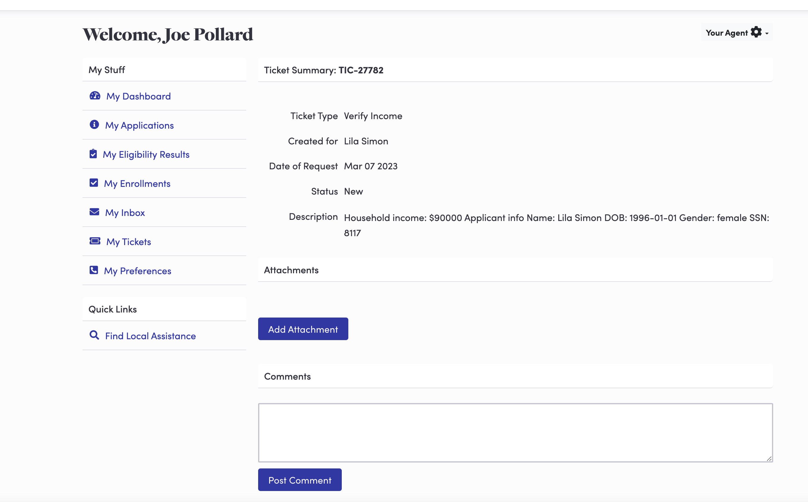
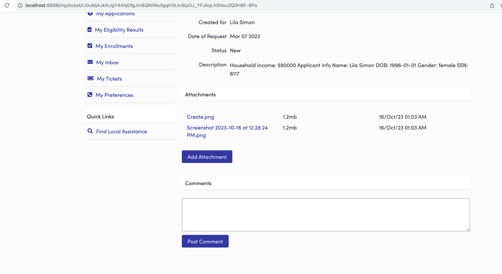
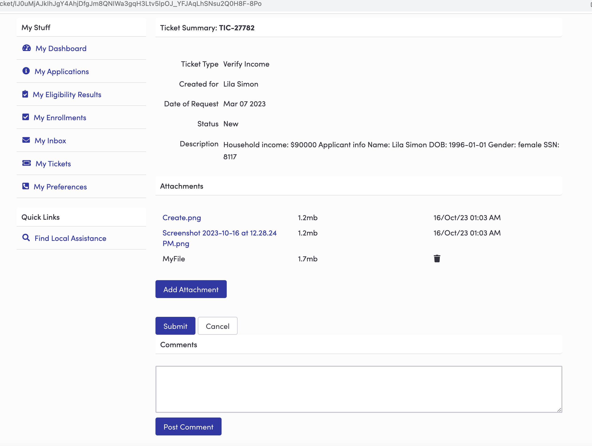

# HIX-174077 Ticketing File-related Improvements 
[Click here to view One-Pager](https://giprod.sharepoint.com/:w:/r/sites/GetInsuredSBMClientCenter/crossclientcollaboration/_layouts/15/Doc.aspx?sourcedoc=%7B816833AD-A046-470D-BED5-0D87441FEC5E%7D&file=HIX-174077%20-%20Ticketing%20File-related%20Improvements.docx&action=default&mobileredirect=true)

This document briefly describe the file upload functionlity for consumer view .

## Task 1 :- Adding new section for attachments 

Flow:-

Login as a consumer and click on my tickets. 

Click on any ticket from the ticket history table. 

## Task 2 :- Attach file and upload

File list            |  File uploaded from local
:-------------------------:|:-------------------------:
  |  

## API calls
| SL NO 	| API Description 	| API Call Exist 	| Header 	| Response 	|
|---	|---	|---	|---	|---	|
| 1 	| Called on landing of ticket details page 	| Yes 	| End Point - /hix/tickets/{encryptedId} Method: GET 	| {     "id":"",     "created":"",     "status":"",     "number":"",     "type":"",     "category":"",     "role":"",     "createdBy":"",     "createdFor":"",     "subject":"",     "details":"",     "updated":"",     "dueDate":"",     "encryptedId":"",     " fileUploadEnabled ":"True" } 	|
| 2 	| Call API to get the file list 	| No 	| End point - /hix/ticketmgmt/ticket/getAttachments/{ticketId} Method: GET 	| [   {    "fileName":"",    "size":"",    "date":"",    "DocPath":"",    "DocId":""    } ] 	|
| 3 	| Call API to view the file 	| No 	| End point - /hix/ticketmgmt/ticket/viewDocument?documentId="+ DocPath+"' Method: GET 	| Will return the document URL. 	|
| 4 	| Call to save multiple file 	| No 	| End point - /hix/ticketmgmt/ticket/consumer/uploadAttachments  Request Param - String ticketId, MultipartFile[] files    Method: POST 	| Response yet to receive from backend 	|

## Component List 
<table>
    <thead>
        <tr>
        <th>Task</th>
        <th></th>
        </tr>
    </thead>
    <tbody>
        <tr>
            <td >1</td>
            <td>
                <table> 
                    <thead>
                        <tr>
                        <th colSpan="3">UI Change</th>
                        <th>Unit Test</th>
                        </tr>
                    </thead>
                    <tr> 
                        <td>Show Attachment Section </td> 
                        <td>
                        If the consumer has the ability to upload a file OR at least one file associated with ticket was uploaded by the current user, expose the Attachments section. 
                        </td> 
                        <td>
                            <ul>
                                <li>
                                Ability to upload – use “fileUploadEnabled” key from API (SL No 1) 
                                </li>
                                <li>
                                Check File List – check array list length returned from API (SL No 2)
                                </li>
                            </ul>
                        </td> 
                        <td>
                            <ul>
                                <li>
                                Attachment section should be visible with the list of attachments.
                                </li>
                                <li>
                                Number of files should be same as the length of fileList[].
                                </li>
                                <li>
                                If permission is false but there are already uploaded files for the consumer then Attachment section will be seen with the file list but Add attachment button will not be visible.
                                </li>
                            </ul>
                        </td> 
                    </tr> 
                        <tr> 
                        <td>Show Add Attachment Button </td> 
                        <td>
                         If the consumer has ability to upload file to ticket AND ticket status is not closed/cancelled, expose “Add Attachment” button. 
                        </td> 
                        <td>
                            <ul>
                                <li>
                                Ability to upload – use “fileUploadEnabled” key from API (SL No 1) 
                                </li>
                                <li>
                                Check Ticket Status – user “status” key returned from API (SL No 1) 
                                </li>
                            </ul>
                        </td> 
                        <td>
                            <ul>
                                <li>
                                Add attachment button should only be visible if user has permission and ticket status does not equal to closed/cancelled.
                                </li>
                                <li>
                                onclick of button user should be able to upload file from loal machine.
                                </li>
                            </ul>
                        </td> 
                    </tr> 
                    <tr> 
                        <td>Show File List</td> 
                        <td>
                           Show the following file details which are already uploaded :- 
                           <ul>
                                <li>
                                File name as link to file, that when clicked, is viewable
                                </li>
                                <li>
                                Size of file 
                                </li>
                                 <li>
                                Upload date 
                                </li>
                            </ul>
                        </td> 
                        <td>
                            <ul>
                                <li>
                                File Details - Find the values from API (SL No 2) To View File – Call API (SL No 3) .
                                </li>
                                <li>
                                Show file size in mb if more than 1024 kb
                                </li>
                            </ul>
                        </td> 
                        <td>
                            <ul>
                                <li>
                                File name should be clickable and on click should open file in a new tab.
                                </li>
                                <li>
                                If the file name is very long it should come to the next line after acquiring the column width.
                                </li>
                                <li>
                                Delete Icon should not be visible for already uploaded files.
                                </li>
                            </ul>
                        </td> 
                    </tr>  
                </table> 
            </td>
        </tr>
        <tr>
            <td>2</td>
            <td>
                <table> 
                    <tr> 
                        <td>Attach new document from system</td> 
                        <td>
                       On click of “Add Attachment” button consumer should be able to select file from local 
                       machine and once consumer select any file submit and Cancel button should be visible. 
                        </td> 
                        <td></td> 
                        <td>
                            <ul>
                                <li>
                                Once consumer selects any file, list with name size and trash icon should be visible.
                                </li>
                                <li>
                                Submit and cancel button also should visible .
                                </li>
                            </ul>
                        </td> 
                    </tr> 
                        <tr> 
                        <td>Show newly uploaded file </td> 
                        <td>
                         Newly selected files should appear with a trash icon to give the ability to delete the file before uploading. 
                        </td> 
                        <td>
                            <ul>
                                <li>
                                Add Attachment” button should be still available to upload multiple files. 
                                </li>
                            </ul>
                        </td> 
                        <td>
                            <ul>
                                <li>
                                File name should not be clickable if not uploaded yet. 
                                </li>
                                <li>
                                There is no restriction on the number of files to upload at a time. 
                                </li>
                            </ul>
                        </td> 
                    </tr> 
                    <tr> 
                        <td>Delete File</td> 
                        <td>
                           On click of trash icon file should be deleted. 
                        </td> 
                        <td>
                        </td> 
                        <td>
                            <ul>
                                <li>
                                Should delete the file from the row. 
                                </li>
                                <li>
                                Other files should be still visible. 
                                </li>
                                <li>
                                If the consumer deletes all the newly added temporary files from the screen, then it should hide the submit and cancel button. 
                                </li>
                            </ul>
                        </td> 
                    </tr> 
                    <tr> 
                        <td>Cancel Button Click</td> 
                        <td>
                           Clicking on the cancel button should delete all the newly added files from the screen, and also should hide the submit and cancel button itself.  
                        </td> 
                        <td>
                            <ul>
                                <li>
                                Delete the files from UI only. 
                                </li>
                                 <li>
                                Hide the submit and cancel button . 
                                </li>
                            </ul>
                        </td> 
                        <td>
                            <ul>
                                <li>
                                Clicking on the cancel button should delete all the temporary added files from UI. 
                                </li>
                                <li>
                                should remove the submit and cancel button . 
                                </li>
                            </ul>
                        </td> 
                    </tr> 
                    <tr> 
                        <td>Save Button click </td> 
                        <td>
                           On Click of submit it should post all the newly added files present at that moment. And on success of that submit and cancel button should not be visible . 
                        </td> 
                        <td>
                            <ul>
                                <li>
                                Call API (SL No 4) to post the files to backend. 
                                </li>
                                <li>
                                Show the loader .
                                </li>
                                <li>
                                If successful refresh the page. 
                                </li>
                                <li>
                                If there is any error show modal with message. 
                                </li>
                            </ul>
                        </td> 
                        <td>
                            <ul>
                                <li>
                                On success should remove the submit and cancel button and the uploaded file list should update. 
                                </li>
                                <li>
                                Should Refresh the page if successful. 
                                </li>
                                <li>
                                On error it should show a modal to display the error message. 
                                </li>
                            </ul>
                        </td> 
                    </tr>  
                </table> 
            </td>
        </tr>
    </tbody>
</table>

:::note

What should be the file size which can be uploaded ? 

What are the allowed file types? 

How to show the file name if the text is very long ?  

How to show the error if file upload fails? 
:::

