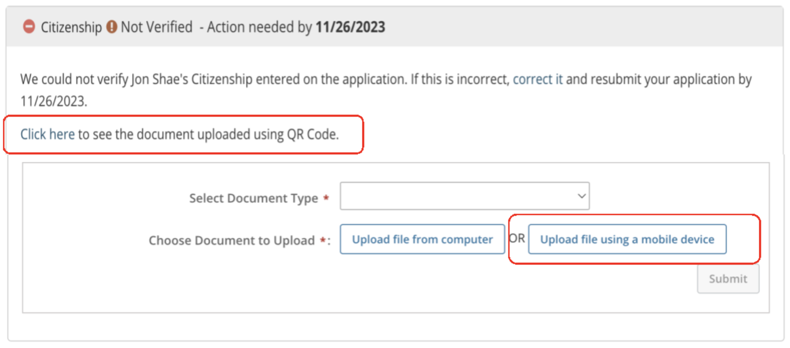
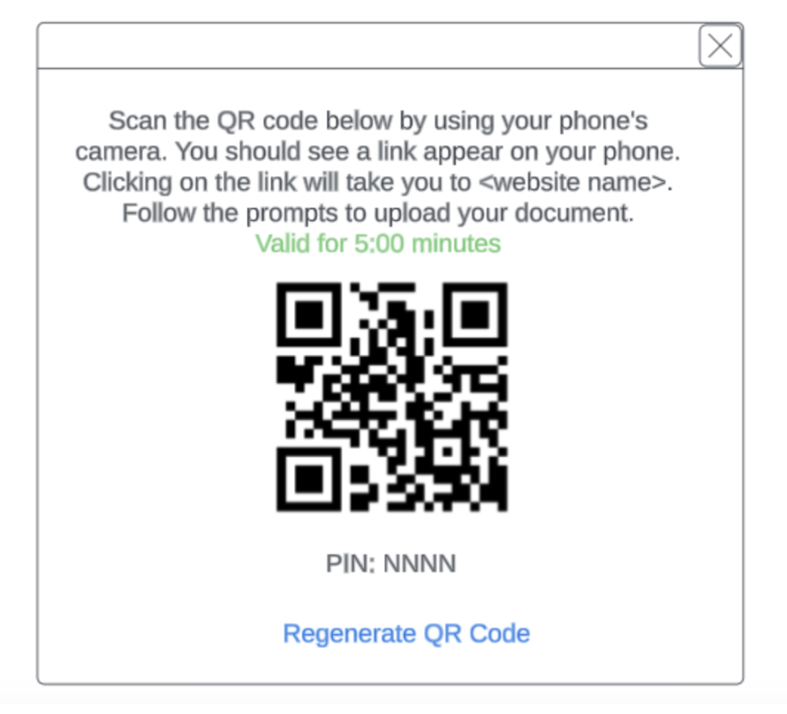
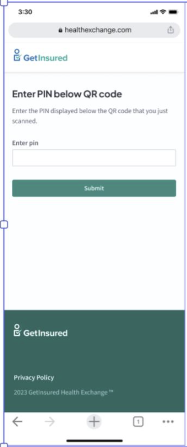
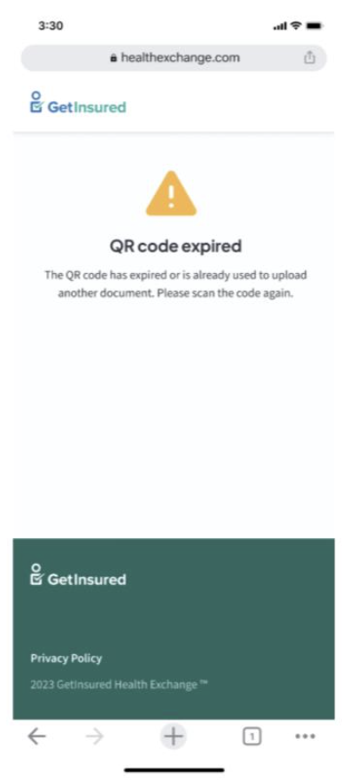
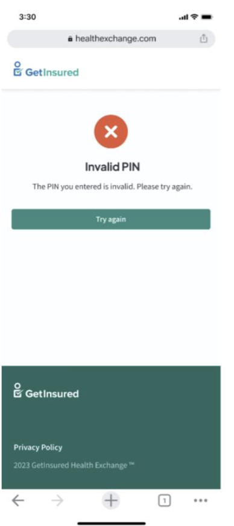
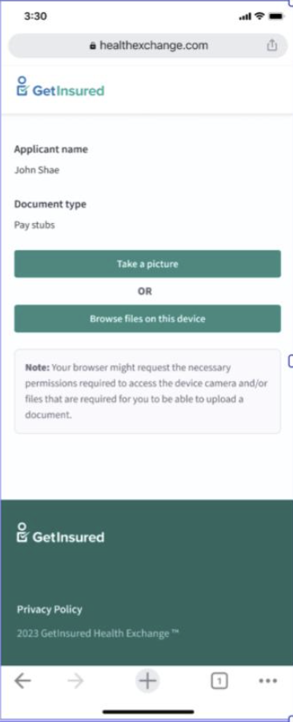
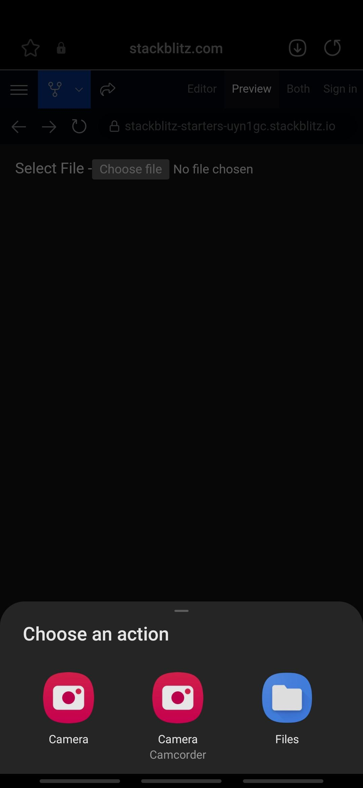
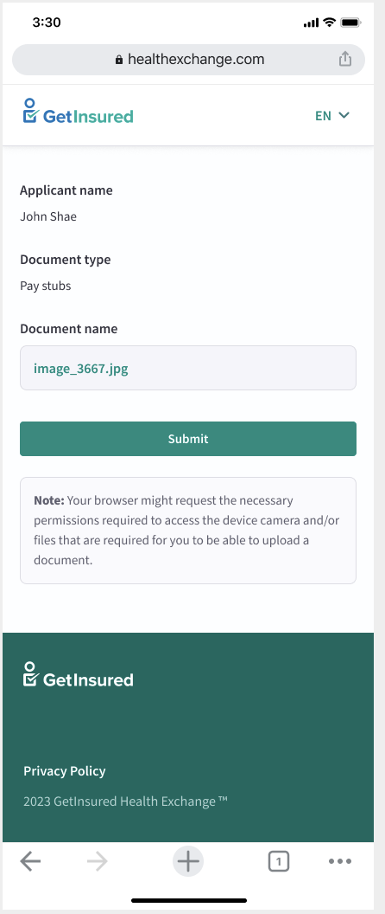
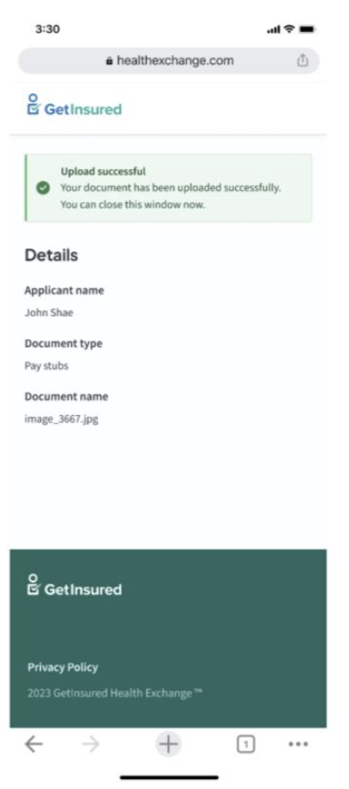

# HIX-174336 Technical Document
[Click here to view One-Pager](https://giprod.sharepoint.com/:w:/r/sites/GetInsuredSBMClientCenter/crossclientcollaboration/Shared%20Documents/UAT%20Prep%20Materials/24.3%20UAT%20Prep%20Materials/HIX-174204%20-%20Upload%20Document%20with%20QR%20Code.docx?d=w299d29a41fa542a1a828c5f8d959d34d&csf=1&web=1&e=4GI6k4)

This document briefly describe the file upload functionlity from mobile devices.

* The scope of this feature will be limited to document upload for Non-Income DMIs. The feature will be extended to Income DMIs, QLE, and RIDP features in a later release.
* This feature to upload a document using a mobile device will be enabled for all User Roles (i.e. Consumers, Brokers and Admin roles).

##  Blockers/Dependancies
* IEX Tomcat Local Setup

##  Information Needed
* Need colour details for QR code popup modal(color of "Valid for 5 minutes" & "Regenerate QR Code" link text).
* Need Error screen mock up for maximum retries exceeded.
* Need English/Spanish content for all the labels and messages.
* Need UI validation error messages for PIN validation
* Need updated mockup for select a file screen.
* Need updated mock up for confirmation page as document name is clickable.

## 1. <b>Applican't Varification Page</b>

#### Select "US Citizenship Not Verified"
* When user navigate to the US Citizenship(Not Verified screen) for NonIncome DMI.
* users can see the "Upload file from computer" and "Upload file using mobile device" file chooser after secting the document type.
						
#### Click on "upload doc on mobile device" button
*  user selects the document type from the Select Document Type dropdown then the "Upload file from computer" and "Upload file using a mobile device" file choosers should be visible as shown in the below screen.

### Manual Test Scenarios
* Should show "Upload file from computer" and "Upload file using mobile device" buttons only when document type is selected.
* Should enable submit button when document type is selected and file is selected from computer.
* Should show clickable link(click here) on the citizenship not verified screen all the time.
* Should call fetch api to refresh the list of uploaded documents on click of "click here" link.
* Should open the modal on click of "Upload file using mobile device" button.
						
### Show "QR code" in a Modal
* When user clicks on the button "Uplod file using a mobile device", a pop up modal should be opened which will have a unique QR code and a PIN.
* QR code and PIN is generated at the backend using a unique encrypted ID. This QR code will be valid only for 5 mins.
* QR code will be valid for 5min, there will be count down on the modal.
* There will be a Regenerate QR Code option to regenarate the QR code in case it is expired or the count down is over.

### Manual Test Scenarios
* Modal should show QR code received from API
* Modal should show website name in plain text which will be diffrent for diffrent state.
* QR code should be valid for 5 mins.
* Modal should show PIN received from API.
* Modal should show count down for QR validity(5min).
* Modal should show regenerate QR code link only when QR Code is expired or count down is over.
* Regenerate QR code link should call generateQRCode api and reload the modal with new QR code and PIN.
* Regenerate QR code link will be invisible by default
* Should show uploaded file name after uplaod is done and user Click on "Click here" link.
* Website name values for each State are as below

  | State Code 	| Website Name 	|
|---	|---	|
| NJ 	| enroll.getcovered.nj.gov 	|
| PA 	| enroll.pennie.com 	|
| ID 	| idahohix.yourhealthidaho.org 	|
| NV 	| enroll.nevadahealthlink.com 	|
| VA 	| enroll.marketplace.virginia.gov 	|

					
## 2. <b>Upload Document on Mobile Device</b>
						
###  Mobile device scan QR code
* Once user scan the QR code generated in the previous step through mobile device, User will get an application url on the screen. the application url will have a unique encrpted id as a query param. this unique id is used to generate the QR code.
* When application url is opened in mobile browser, user will be seeing the home screen which will ask for PIN generated along with QR code.

### Enter PIN
* user will enter the PIN generated along with QR code and click submit. FE will send the PIN and unique encrypted id to BE to authenticate the QR code and PIN
* After entering the PIN and click submit button, validation api is called to validate the request based on PIN and unique QR code in backend.

### Manual Test Scenarios
* Should show exchange wise header bar at the top of the web page
* Exchange Icon on the header should not be clickable
* Should show language change toggle on the header
* Should change the language on click of toggle(English/Espanol)
* Should show states/exchange wise default footer at the bottom of the web page
* Should open all the links on the footer in the new tab

##### The Validation API return the response of validation request, Based on the response user will be navigated to either error screen or select file screen.

#### if successful
* If entered PIN and QR is valid and matching then user will be navigated to the upload document screen.
#### if fail
* If QR code is expired, QR Code Expired error screen will be shown.

* In case of invalid PIN, Invalid PIN error screen will be shown which will have retry option.

* The Try Again button will navigate user to the Home screen.
* Maximum 3 retries are allowed per QR code.
* Incase maximum retries are exceded?. 
 [TBD] Need a mockup.

### Unit Test cases
 * Should not be allowed to enter characters.
 * Should allow entering 4 digit number only.
 * Should navigate to invalid pin error page when pin is incorrect.
 * Should navigate to QR expiration page when QR code is expired.
 * [TBD](Need Mockup) Should show maximum retries exceeded message when max retries are over.
 * Should navigate to document selection page on success

### <b>Choose File to Upload</b>
* There will be a input field to choose the file for uploading. Choose file field internally configured such a way that it will ask user to select either mobile camera or a file system of the mobile device.
* after user selects the file, they can still select another file which will replace the previously selected file before upload.
* file validations will be performed on file slection
* There will be submit button, on clicking it, Upload API will be called to upload the file.

[TBD] Need a mockup
<!--  -->

#### iOS view
* [TBD]
#### Android view

### File Validation
* The size of the file should not be more that 5MB.
* The supported file types are DOC, DOCX, XLS, XLSX, GIF, JPG, JPEG, PNG or PDF

### After File Selected
* once user select the file, input field will show the selected file name as placeholder.
* Submit button will be visible

### Unit Test Scenarios
* Should show Choose file input field 
* Should show file size validation error message when file is more than 5MB  (Validation Message: File size allowed: 5MB)
* Should show file type validation error message when file type is not supported. ( Validation Message: Your file could not be uploaded. Use one of these file types: DOC, DOCX, XLS, XLSX, GIF, JPG, JPEG, PNG, or PDF.)
* Should upload file successfully on upload click
* Should navigate to QRCodeExpiration error page when api returns QR expirated error on upload
* Should show Submit button if file validations are pass.

### <b>Show Confirmation Page</b>
* Once user choose the valid file and click Upload button, file upload api is called and file is uploaded to the server and stored.
* On successfull file uplaod user will be navigated to the confirmation screen which will have success message, applican't name, document type and document name.

### Unit Test Scenarios
* Should show Applican't name.
* Should show Document name.
* Document name should be clickable
* Should open document preview in popup same as it is working currently(open url in new popup window)
* Should show Document type.
					
<!-- ## 3. Show Result of Uploaded Document
### ping API to get results of uploaded document
* After the document is uploaded the citizenship not verified page  should refresh and show newly uploaded document.
* There will be either a refresh button next to submit button or page will refresh automaticlly after pop up modal is closed.
* In case of refresh button, users have to click refresh button to fetch the uploaded document details after document upload is done on mobile screen.
* After clicking refresh button or closing popup modal, all the documents details related to the user shown on the screen.
* Document name should be clickable and should open in new pop up window when clicked. -->

## 3. <b>APIs Required for Citizenship Screen</b>

* baseUrl/GetQRCode

| SL NO 	| API Description 	| Header 	| Response 	|
|---	|---	|---	|---	|---	|
| 1 	| Called on click of Upload file using mobile device 	| End Point - hix/docsUploadByqRCode/generateQRCode Method: GET 	| {     "pin":"4123",     "qrCode":"hjhjc++jjckjk/+&$jkjkjkjkjkk/+&$jgfrdrtytu/+&$=i54876rtfgvb",     "qrGenerationDate":"2023-10-11 07:04:26",     "status":"success/failure",     "errorMessage":"",     "errorCode":"[TBD]", } 	|
| 2 	| Called on click of refresh button 	| End Point - /hix/fetchUploadData Method: GET 	| [TBD] 	|

## 4. <b>APIs Required for Document Uploader App</b>

  | SL NO 	| API Description 	| Header 	| Response 	|
|---	|---	|---	|---	|---	|
| 1 	| Called on Application Load 	|  End Point - /hix/environment Method: GET 	| {"status":"",     "stateCode":"",     "exchangeName":"",     "ErrorMessage":"", } 	|
| 2 	| Called on click of Submit button 	|  End Point - hix/docsUploadByqRCode/validateQRCode Method: POST 	| {"applicantName": "Hary Writh",     "documentType": "citizen_cert",     "encryptedToken": "encrypted primary key"     "status": "success",     "errorMessage": "..",     "errorCode ": ".." } 	|
| 3 	| Called on click of Upload button 	|  End Point - hix/docsUploadByqRCode/uploadDocuments  Method: POST 	| {"ecmDocumentId": "S3:ID/EL/VERIFI/8aac51ad-82f0-4a28-90be-8a3530b47234",     "applicantName": "Hary Writh",     "documentType": "citizen_cert",     "status": "success",     "errorMessage": ""     "errorCode ": ".." } 	|

## 5. <b>Component List</b>

<table>
    <thead>
        <tr>
        <th>Task</th>
        <th></th>
        </tr>
    </thead>
    <tbody>
        <tr>
            <td >1</td>
            <td>
                <table> 
                    <thead>
                        <tr>
                        <th colSpan="3">UI Change</th>
                        <th>Unit Test</th>
                        </tr>
                    </thead>
                    <tr> 
                        <td>Show PIN varification Section </td> 
                        <td>
                        When user scan the QR code with mobile device, a application url will be opened in the mobile browser. User will be landed on the PIN varification screen. User will have to enter the PIN generated along with QR code in the previous step.
                        </td> 
                        <td>
                            <ul>
                                <li>
                                Ability to enter PIN
                                </li>
                                <li>
                                Call Submit API on Submit click
                                </li>
                            </ul>
                        </td> 
                        <td>
                            <ul>
                                <li>
                                Should not be allowed to enter characters.
                                </li>
                                <li>
                                Should allow entering 4 digit number only.
                                </li>
                                <li>
                                Should show invalid pin error when pin is incorrect.
                                </li>
                                <li>
                                Should show QR expiration message when QR code is expired.
                                </li>
                                <li>
                                Should show maximum retries exceeded message when QR code is expired.
                                </li>
                                <li>
                                Should navigate to document selection page on success
                                </li>
                            </ul>
                        </td> 
                    </tr> 
                </table>
            </td>
        </tr>
        <tr>
            <td >2</td>
            <td>
                <table>
                     <thead>
                        <tr>
                        <th colSpan="3">UI Change</th>
                        <th>Unit Test</th>
                        </tr>
                    </thead>
                    <tr> 
                        <td>Show File Selector </td> 
                        <td>
                         If the user is varified the PIN and QR code successfully, user will be navigated to this screen. 
                        </td> 
                        <td>
                            <ul>
                               <li>
                               Ability to select file from mobile directory.
                               </li>
                               <li>
                               Ability to capture file from mobile camera.
                               </li>
                               <li>
                               Ability to upload the file
                               </li>
                               <li>
                               Ability to navigate to error screen in case api returns QR expirated error on upload
                               </li>
                            </ul>
                        </td> 
                        <td>
                            <ul>
                                 <li>
                                Should show Choose file input field 
                                </li>
                                <li>
                                Should show file size validation error message when file is more than 5MB 
                                </li>
                                <li>
                                Should show file type validation error message when file type is not supported
                                </li>
                                <li>
                                Should upload file successfully on upload click
                                </li>
                                <li>
                                Should show QR code expiration error in case api returns QR expirated error on upload
                                </li>
                            </ul>
                        </td> 
                    </tr>
                </table>
            </td>
        </tr>
        <tr>
            <td >3</td>
            <td>
                <table>
                     <thead>
                        <tr>
                        <th colSpan="3">UI Change</th>
                        <th>Unit Test</th>
                        </tr>
                    </thead>
                    <tr> 
                        <td>Show Confirmation after upload</td> 
                        <td>
                           Show the following file details which are already uploaded :- 
                           <ul>
                                <li>
                                Document name 
                                </li>
                                <li>
                                Applican't Name 
                                </li>
                                 <li>
                                Document Type 
                                </li>
                            </ul>
                        </td> 
                        <td>
                            <ul>
                                <li>
                                Find the values from API.
                                </li>
                            </ul>
                        </td> 
                        <td>
                            <ul>
                                <li>
                                Should show Applican't name.
                                </li>
                                <li>
                                Should show Document name.
                                </li>
                                <li>
                                Document name should be clickable
                                </li>
                                <li>
                                Should open document preview in popup same as it is working currently(open url in new popup window)
                                </li>
                                <li>
                                Should show Document type.
                                </li>
                            </ul>
                        </td> 
                    </tr>
                </table>
            </td>
        </tr>
        <tr>
            <td >4</td>
            <td>
                <table>
                     <thead>
                        <tr>
                        <th colSpan="3">UI Change</th>
                        <th>Unit Test</th>
                        </tr>
                    </thead>
                    <tr> 
                        <td>Show Error Screen</td> 
                        <td>
                           <ul>
                                <li>
                                QR Expired error message  
                                </li>
                                <li>
                                Invalid PIN error message 
                                </li>
                            </ul>
                        </td> 
                        <td>
                            <ul>
                                <li>
                                Find the error value from API.
                                </li>
                            </ul>
                        </td> 
                        <td>
                            <ul>
                                <li>
                                Should show Try Again button in case of PIN invalid error.
                                </li>
                                <li>
                                Should allow max 3 retries.
                                </li>
                            </ul>
                        </td> 
                    </tr>
                </table>
            </td>
        </tr>
    </tbody>
</table>       

## 6. <b>Developement Plan</b>

  | SL NO 	| Efforts 	| Tasks 	| Dependancy 	| Comment 	|
|---	|---	|---	|---	|---	|
| 1 	|  7 Days	| - Setup mono repo   - Implementation of QR Code Popup 	| GenerateQRCode API 	| -- 	|
| 2	| 5 Days	| - Implementation of Landing page  - Implementation of Invalid Error page   - Validations  -  implementation of qr code expiration page 	| - validateQRCode API 	| -- 	|
| 3 	|  8 Days 	|  - Build choose file page   - Build upload page  - Build Confirmation page  - Show file preview on click of file name	 | - upload API 	| -- 	|
| 4 	|  3 Days	|  - Integrate Header and Footer  - Add messages for english and spanish content  - Integration of APIs and tests	 | - All APIs  - Header & Footer components 	| -- 	|
| 5 	|  5 Days 	| - Feedback/Reviews/Amendments	 | -- 	| -- 	|

:::note
The above dev plan is based on the information or clarity that we have as on 4th Dec 2023 and assuming all the blockers are resolved, any changes or ammendments would impact the plan.

:::note
* What is Exchange Name? is it Logo or text ? A. Logo and English/Spanish Toggle. Should be same as existing application.
* Should we show the PIN as user enters it? or it will be **** ? A. PIN
* From where should we get the Applicant name and document type ? Should API return this info ? A. API
* What screen should we show after clicking on Take a Picture ? Camera Permission popup ? only once or every time ? A. Only Once
* Same for Browse files options ? A. Only Once
* Should there be options to delete the selected file or picture taken and select/take a new one ? A. Will add another screen to preview/file Name and the upload button.
* Should we preview/details of the picture taken or file selected on the screen? A. Yes, on the final screen, after the upload is done.
* After taking a picture or selecting a file, should there be a upload button for uploading the document ? A. Yes
* What will be the valid file types ? A. updated in the document
* Is multiple files selection allowed ? if yes how many ? A. No, Only one file at a time.
* What minimum or maximum file size is allowed to upload ? A. Updated in the document. 5MB
* What will be the size validation message and placement of it ? A. Just like the existing validations in the app
* How many retries allowed per QR for the PIN validation ? A. 3
* Should ‘Regenrate QR Code’ link disabled till QR code is valid ? Show countdown and enable link after count down is over. A. Regenerate QR Code link will be shown only whan QR is expired or count down is over.
:::