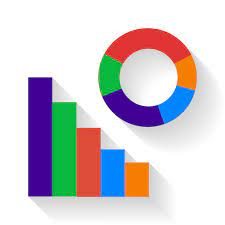
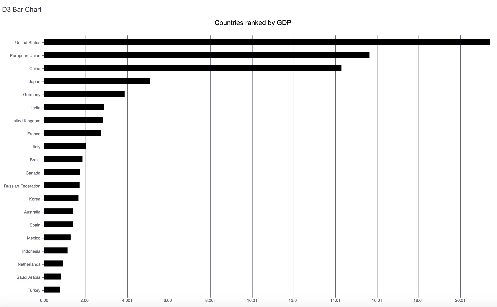
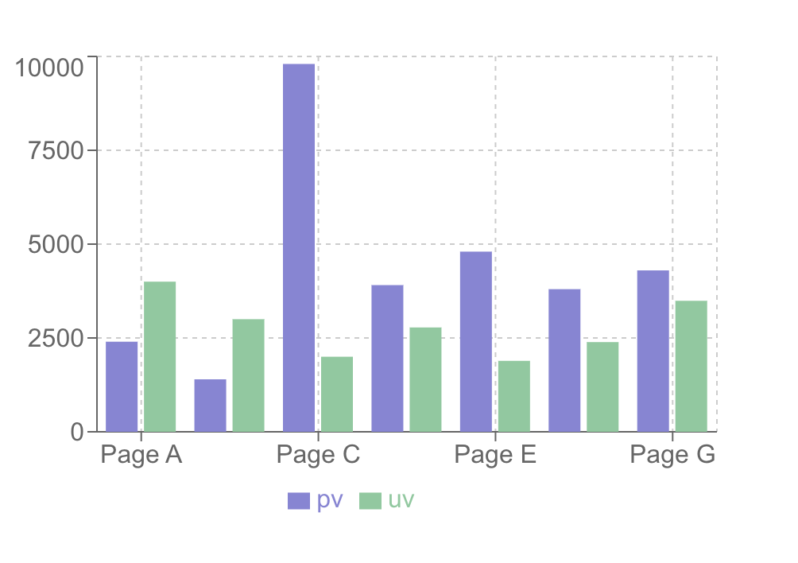

A curated list of chart libraries that developers may find useful. Focused on relevant and currently active JavaScript charting libraries for different use cases.

## List of some free and open source libraries for React

* [React Google Charts](https://developers.google.com/chart/) - This library leverages the robustness of Google’s chart tools combined with a React-friendly experience
* [D3.js](https://d3js.org/) - Allows the user to manipulate documents based on data to render charts in SVG.
* [Recharts](https://recharts.org/) -  A blend of D3’s power with React’s elegance, make Recharts great for crafting responsive and stylish charts with an intuitive API.
* [React-charts](https://github.com/TanStack/react-charts/) - A simple and modern library, perfect for getting started without heavy configurations.
* [React-chartkick](https://github.com/ankane/react-chartkick/) - Aims for simplicity with a minimalistic API. It supports multiple charting engines like Chart.js, Google Charts, and Highcharts.
* [React-flow-chart](https://github.com/MrBlenny/react-flow-chart) - Best suited for creating flowcharts or node-based diagrams with a customizable drag-and-drop interface.
* [React-financial-charts](https://github.com/react-financial/react-financial-charts) - Explicitly tailored for financial applications like stock trading or forex (FX) platforms, making it the go-to choice for financial visualizations.

## Comparison between some of the libraries mentioned below

| Library Name| Ease of use | Customization | Learning Curve | Support | Use cases
| --- | --- | --- | --- | --- | --- |
| React Google Charts | Yes | Deep customization is limited | Less to no | Good | Recommended for projects with ease of use, minimal configuration.
| D3 | Integrating D3 with React can be less straightforward, often requiring manual DOM management | Highly customizable | Steep learning curve | Strong community support | Recommended for projects higher customization and handling large data sets.
| Recharts | Yes | Highly customizable | Moderate | Good | Recommended for projects requiring higher customization and handling large data sets.
| React Charts | Yes | Limited customization | Less | Good | Recommended for projects with ease of use.
| React Chartkick | Yes | Limited customization | Less | Average | Recommended for projects requiringease of use, minimal setup and quick visualizations.

## Recommendations

* D3.js
* Recharts

## Installation

* D3

```sh
pnpm install d3
```
* Recharts

```sh
pnpm install recharts
```
## Code Sample of Bar Chart

* D3



```js
import { useEffect } from "react";
import * as d3 from "d3";

function BarChart() {
  useEffect(() => {
    d3.csv(
      "https://raw.githubusercontent.com/connorpheraty/d3-barchart-example/main/src/data.csv"
    ).then(function (data) {
      data.forEach(function (d) {
        d.gdp = +d.gdp;
      });
      drawChart(data);
    });
  });

  const drawChart = (data) => {
    const svg = d3.select("#chartId");

    const width = +svg.attr("width");
    const height = +svg.attr("height");

    const margin = { top: 50, right: 40, bottom: 75, left: 100 };

    const innerWidth = width - margin.left - margin.right;
    const innerHeight = height - margin.top - margin.bottom;

    const chartTitle = "Countries ranked by GDP";
    const barChartXAxisLabel = "GDP";

    const xValue = (d) => +d.gdp;

    const xScale = d3
      .scaleLinear()
      .domain([0, d3.max(data, xValue)])
      .range([0, innerWidth]);

    const yScale = d3
      .scaleBand()
      .domain(
        data.map(function (d) {
          return d.country;
        })
      )
      .range([0, innerHeight])
      .padding(0.1);

    const tooltip = d3.select("body").append("div").attr("class", "tooltip");

    const g = svg
      .append("g")
      .attr("transform", `translate(${margin.left}, ${margin.top})`)
      .attr("class", "axis");

    g.append("text")
      .attr("x", innerWidth / 2 - 125)
      .attr("y", 0 - margin.top / 2)
      .attr("class", "chart-title")
      .text(chartTitle);

    const xAxisTickFormat = (number) =>
      d3.format(".3s")(number).replace("G", "B");

    const xAxis = d3
      .axisBottom(xScale)
      .tickFormat(xAxisTickFormat)
      .tickSize(-innerHeight);

    const xAxisG = g
      .append("g")
      .call(xAxis)
      .attr("transform", `translate(0, ${innerHeight})`);

    xAxisG.select(".domain").remove();

    xAxisG
      .append("text")
      .attr("class", "axis-label")
      .attr("y", 50)
      .attr("x", innerWidth / 2)
      .attr("fill", "black")
      .text(barChartXAxisLabel);

    const yAxis = d3.axisLeft(yScale);

    const yAxisG = g.append("g").call(yAxis);

    yAxisG.selectAll(".tick text").attr("class", "y-axis-ticks");

    yAxisG.select(".domain").remove();

    g.selectAll("rect")
      .data(data)
      .enter()
      .append("rect")
      .attr("class", "rect")
      .attr("y", function (d) {
        return yScale(d.country) + 5;
      })
      .attr("width", function (d) {
        return xScale(d.gdp);
      })
      .attr("height", yScale.bandwidth() / 2).on("mouseenter", function () {
        d3.select(".tooltip").attr("opacity", 0.5);
      })
      .on("mouseleave", function () {
        d3.select(".tooltip").attr("opacity", 1);
      })
      .on("mouseover", function () {
        return tooltip.style("visibility", "visible");
      })
      .on("mousemove", function (event, d) {
        return tooltip
          .style("top", event.pageY + 30 + "px")
          .style("left", event.pageX + 20 + "px")
          .html("GDP: $" + d3.format(".3s")(d.gdp).replace("G", "B"));
      })
      .on("mouseout", function () {
        return tooltip.style("visibility", "hidden");
      });
  };

  return (
        <div className="container">
            <svg id="chartId" height="750" width="1200" className="svg-chart"></svg>
        </div>
  );
}

export default BarChart;
```
* Recharts



```js
import {
  BarChart,
  Bar,
  XAxis,
  YAxis,
  CartesianGrid,
  Tooltip,
  Legend
} from "recharts";

const data = [
  {
    name: "Page A",
    uv: 4000,
    pv: 2400,
    amt: 2400
  },
  {
    name: "Page B",
    uv: 3000,
    pv: 1398,
    amt: 2210
  },
  {
    name: "Page C",
    uv: 2000,
    pv: 9800,
    amt: 2290
  },
  {
    name: "Page D",
    uv: 2780,
    pv: 3908,
    amt: 2000
  },
  {
    name: "Page E",
    uv: 1890,
    pv: 4800,
    amt: 2181
  },
  {
    name: "Page F",
    uv: 2390,
    pv: 3800,
    amt: 2500
  },
  {
    name: "Page G",
    uv: 3490,
    pv: 4300,
    amt: 2100
  }
];

export default function RechartBarChart() {
  return (
    <BarChart
      width={500}
      height={300}
      data={data}
      margin={{
        top: 5,
        right: 30,
        left: 20,
        bottom: 5
      }}
    >
      <CartesianGrid strokeDasharray="3 3" />
      <XAxis dataKey="name" />
      <YAxis />
      <Tooltip />
      <Legend />
      <Bar dataKey="pv" fill="#8884d8" />
      <Bar dataKey="uv" fill="#82ca9d" />
    </BarChart>
  );
}
```

See also
--------

* [React Charting Libraries](https://ably.com/blog/top-react-chart-libraries): Top react charting libraries
* [React Charting Libraries](https://technostacks.com/blog/react-chart-libraries/): Top 15 React Chart Libraries For Your Web Projects


